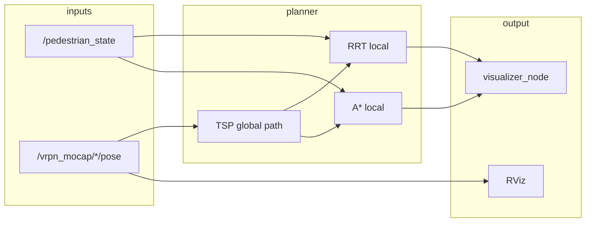

# Navigation Controller — RRT · A* · TSP

ROS 2 navigation stack for multi-waypoint missions: **TSP** global planning, local **RRT** and **A\*** path following, **APF** pedestrian avoidance, and a live **matplotlib** visualizer. Supports full simulation and a **6 m × 6 m** deployment mode with optional OptiTrack MoCap.

```bash
make help    # list all commands
```

---

## Overview

| Layer | Role |
|-------|------|
| **Global** | TSP orders waypoints; path cached in `data/` |
| **Local** | RRT + A* steer with potential fields around static and dynamic obstacles |
| **Sensing** | Simulated pedestrians, or live MoCap obstacles via VRPN |
| **Viz** | Matplotlib live view (paths, ellipses, APF field) or RViz preview |



---

## Prerequisites

- **ROS 2 Jazzy** — `source /opt/ros/jazzy/setup.bash`
- **Python 3** — `numpy`, `matplotlib`
- **MoCap (optional)** — VRPN workspace built under `vrpn_ws/`

All `make` targets source ROS automatically. Python modules run from `src/nav_stack/` via `python3 -m nav_stack.…`.

---

## Quick start

### Simulation — one terminal

```bash
make stop && make ros
```

Waits ~90 s for TSP, then opens the visualizer. Press `q` in the pedestrian terminal to quit.

### Simulation — three terminals

```bash
make stop
make fake-mocap   # T1 — static obstacle poses
make ped-deploy          # T1 — pedestrians
make planner      # T2 — planner (TSP ~90 s on first start)
make viz          # T3 — visualizer (after planner is ready)
```

### Deployment — lab 6 m × 6 m (no OptiTrack hardware)

```bash
make stop
make mocap   # T1 — static obstacle poses
make ped-deploy   # T2 — pedestrians in deployment viewport
make planner      # T3 — planner (uses MoCap obstacles + deployment mission)
make viz          # T4 — visualizer
```

### Offline — no ROS

```bash
make tsp-save     # first run: compute & cache TSP path
make mc           # Monte Carlo: RRT vs A*
```

---

## Make commands

| Command | Description |
|---------|-------------|
| **Live stack** | |
| `make ros` | Pedestrian sim + planner + visualizer (one terminal) |
| `make ped` | Pedestrian simulator only |
| `make ped-deploy` | Pedestrians in 6 m × 6 m deployment viewport |
| `make planner` | RRT + A* planner node |
| `make viz` | Matplotlib visualizer |
| `make stop` | Stop all running nodes |
| **MoCap** | |
| `make mocap` | OptiTrack → ROS 2 via VRPN |
| `make fake-mocap` | Static fake poses (no hardware) |
| `make mocap-echo` | Echo one obstacle topic (`OBS=obstacle2`) |
| `make mocap-list` | List `/vrpn_mocap/*` topics |
| **RViz** | |
| `make rviz` | Static obstacles + TSP path preview |
| `make rviz-mocap` | Live MoCap obstacles in RViz |
| **Offline** | |
| `make tsp-save` | Compute TSP → `data/tsp_*.npy` |
| `make tsp` | Plot TSP only (no save) |
| `make mc` | Monte Carlo RRT vs A* |
| `make mc-astar` | Monte Carlo A* only |
| `make mc5` | Alternate Monte Carlo variant |

**Overrides:** `make ped N_PEDS=12 SPEED=1.5 HZ=25`

---

## Project layout

```
trajectory_project/
├── Makefile
├── config/
│   ├── mission_waypoints.json      # sim + deployment missions
│   └── fake_mocap_poses.json       # fake MoCap (auto-reload 5 s)
├── data/
│   ├── tsp_path.npy                # cached global path
│   └── tsp_polyline.npy
├── scripts/
│   └── run_ros2_planner.sh
├── src/nav_stack/
│   ├── paths.py                    # ROOT, CONFIG_DIR, DATA_DIR
│   ├── mission/                    # mission_config, mocap_obstacles
│   ├── params/                     # sim_reference_params
│   ├── planning/                   # APF, RRT, A*, TSP
│   ├── ros/                        # planner, visualizer, ped sim, fake mocap
│   ├── offline/                    # Monte Carlo, computeTSP
│   └── filters/
├── obstacle_viz/                   # RViz publishers
├── vrpn_ws/                        # VRPN ROS 2 workspace
├── results/                        # offline PNGs (gitignored)
└── archive/                        # reference scripts
```

---

## Configuration

| File | Purpose |
|------|---------|
| `config/mission_waypoints.json` | Start, goal, waypoints, viewport, obstacle names |
| `config/fake_mocap_poses.json` | Rigid-body poses for `make fake-mocap` |
| `data/tsp_path.npy` | Precomputed TSP path (`make tsp-save`) |

**MoCap frame mapping:** MoCap +Y → map Z (up); ground plane MoCap X → map X, MoCap Z → map Y.

---

## Keyboard controls

| Node | Keys |
|------|------|
| **Pedestrian sim** (`make ped` / `ped-deploy`) | `h` add · `j` remove · `u` faster · `t` slower · `p` status · `q` quit |
| **Planner** (`make planner`) | `q` + Enter quit |

---

## Repository

[github.com/egeozgul/Navigation-Controller-RRT-Astar](https://github.com/egeozgul/Navigation-Controller-RRT-Astar)
